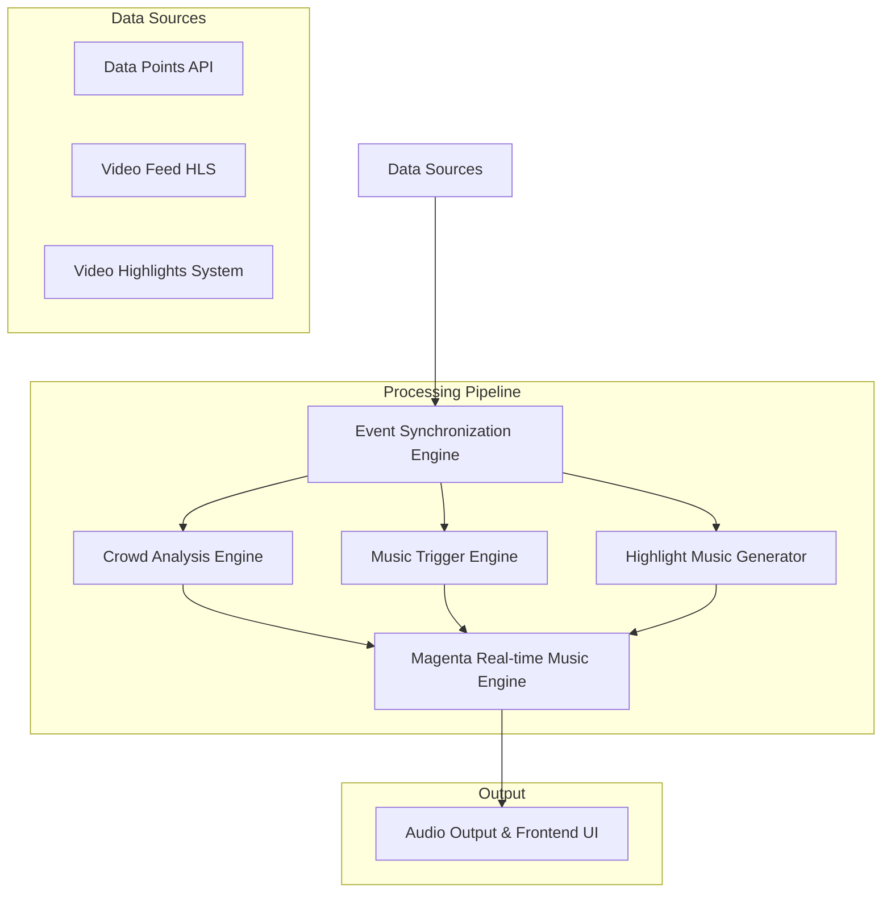
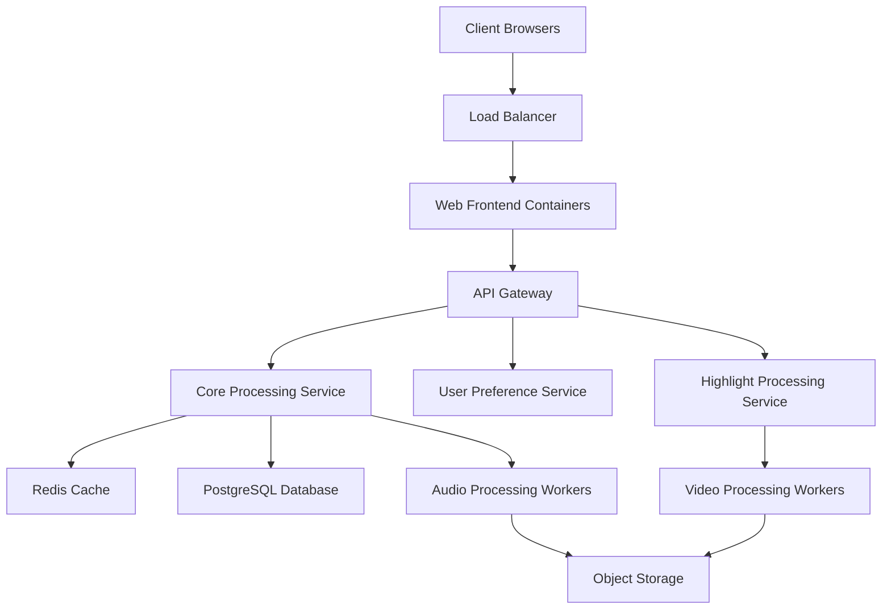

# Design Document: Crowd Sentiment Music Generator

## Overview

The Crowd Sentiment Music Generator is an AI-powered system that analyzes live crowd noise from sports events and generates real-time musical compositions reflecting the emotional journey of the match. The system operates in two primary modes:

1. **Live Mode**: Real-time analysis and music generation during live broadcasts
2. **Highlight Mode**: Post-processing for creating musical soundtracks for match highlights

This design document outlines the architecture, components, data models, and implementation strategies for building a robust, scalable system that meets all the specified requirements.

## Architecture

The system follows a modular, event-driven architecture with the following high-level components:



### Key Components

1. **Data Sources**:
   - Real-time match data (events, statistics) with <1s latency
   - Broadcast video/audio feed with 7-15s latency
   - Video highlights system for post-match processing

2. **Event Synchronization Engine**:
   - Aligns timestamps from different data sources
   - Establishes synchronization points (e.g., kick-off)
   - Manages event buffering for delayed audio processing

3. **Crowd Analysis Engine**:
   - Isolates crowd noise from commentary
   - Extracts audio features using signal processing
   - Classifies emotional states using ML models
   - Measures intensity levels

4. **Music Trigger Engine**:
   - Maps match events to musical responses
   - Determines appropriate musical changes based on events
   - Triggers immediate musical accents for significant events

5. **Magenta Real-time Music Engine**:
   - Generates continuous musical compositions
   - Ensures smooth transitions between emotional states
   - Maintains musical coherence and quality
   - Adapts to cultural contexts

6. **Audio Output & Frontend UI**:
   - Provides visualization of crowd emotions and music
   - Offers controls for adjusting musical parameters
   - Displays event timeline and emotional journey
   - Enables export in various formats

7. **Highlight Music Generator**:
   - Processes video highlights for post-match content
   - Generates synchronized musical soundtracks
   - Provides editing and customization tools

## Components and Interfaces

### 1. Data Ingestion Layer

#### 1.1 Real-time Data API Client

```python
class DataPointsClient:
    """Client for consuming real-time match data points."""
    
    async def connect(self, match_id: str) -> None:
        """Establish connection to data points API for a specific match."""
        
    async def subscribe_to_events(self, callback: Callable) -> None:
        """Subscribe to match events with a callback function."""
        
    def get_latest_match_state(self) -> dict:
        """Get the current match state including score, time, etc."""
```

#### 1.2 Video Feed Processor

```python
class VideoFeedProcessor:
    """Processes incoming video feed to extract audio and timestamps."""
    
    def __init__(self, buffer_size: int = 30):
        """Initialize with a buffer to store recent audio segments."""
        
    def process_chunk(self, video_chunk: bytes, hls_timestamp: float) -> tuple:
        """Process a video chunk and extract audio and timestamp."""
        
    def extract_crowd_audio(self, audio: np.ndarray) -> np.ndarray:
        """Isolate crowd noise from commentary and other sounds."""
```

### 2. Event Synchronization Engine

```python
class SyncEngine:
    """Synchronizes timestamps from different data sources."""
    
    def __init__(self):
        """Initialize synchronization engine with empty buffers."""
        self.kickoff_timestamp = None
        self.hls_offset = None
        self.event_buffer = {}
        
    def sync_with_kickoff(self, data_timestamp: float, hls_timestamp: float) -> None:
        """Establish synchronization point at kick-off."""
        
    def align_timestamps(self, data_time: float) -> float:
        """Convert data timestamp to HLS timestamp."""
        
    def buffer_event(self, event: dict) -> None:
        """Store event in buffer for later processing with audio."""
        
    def get_events_for_audio(self, audio_timestamp: float, window: float = 5.0) -> list:
        """Retrieve events that correspond to a specific audio segment."""
```

### 3. Crowd Analysis Engine

```python
class CrowdAnalyzer:
    """Analyzes crowd audio to determine emotional states."""
    
    def __init__(self, model_path: str):
        """Initialize with pre-trained emotion classification model."""
        
    def extract_features(self, audio_segment: np.ndarray, sr: int = 22050) -> dict:
        """Extract audio features from crowd noise."""
        
    def classify_emotion(self, features: dict, match_context: dict = None) -> tuple:
        """Classify crowd emotion based on audio features and match context."""
        
    def measure_intensity(self, audio_segment: np.ndarray) -> float:
        """Measure emotional intensity on a scale of 0-100."""
```

### 4. Music Trigger Engine

```python
class MusicTrigger:
    """Maps events and emotions to musical responses."""
    
    def __init__(self, music_engine):
        """Initialize with reference to music generation engine."""
        
    def process_event(self, event: dict) -> dict:
        """Process a match event and determine musical response."""
        
    def process_emotion(self, emotion: str, intensity: float) -> dict:
        """Process detected emotion and determine musical evolution."""
        
    def get_musical_parameters(self, event_type: str, emotion: str, intensity: float) -> dict:
        """Get musical parameters based on event type, emotion and intensity."""
```

### 5. Magenta Real-time Music Engine

```python
class MagentaMusicEngine:
    """Generates real-time music based on emotional inputs."""
    
    def __init__(self):
        """Initialize Magenta models and musical state."""
        
    def initialize_base_melody(self, match_context: dict) -> None:
        """Start with appropriate base theme for the match."""
        
    def evolve_music(self, params: dict) -> None:
        """Evolve the music based on new parameters."""
        
    def trigger_accent(self, accent_type: str) -> None:
        """Trigger an immediate musical accent (e.g., for goals)."""
        
    def transition_to(self, target_params: dict, duration: float) -> None:
        """Smoothly transition to new musical parameters."""
        
    def get_audio_output(self) -> np.ndarray:
        """Get the current audio output buffer."""
```

### 6. Frontend UI Components

```typescript
interface MusicVisualizationProps {
    currentEmotion: string;
    intensity: number;
    waveformData: number[];
    eventLog: Event[];
}

const MusicVisualization: React.FC<MusicVisualizationProps> = (props) => {
    // Component for visualizing music and emotions
};

interface MusicControlsProps {
    onIntensityChange: (value: number) => void;
    onStyleChange: (style: string) => void;
    onInstrumentationChange: (instruments: string[]) => void;
}

const MusicControls: React.FC<MusicControlsProps> = (props) => {
    // Component for controlling music parameters
};
```

### 7. Highlight Music Generator

```python
class HighlightMusicGenerator:
    """Generates music for video highlights."""
    
    def __init__(self, music_engine):
        """Initialize with reference to music generation engine."""
        
    def process_highlight(self, video_path: str, events: list) -> str:
        """Process a video highlight and generate appropriate music."""
        
    def align_music_to_video(self, music: np.ndarray, video_duration: float) -> np.ndarray:
        """Align generated music with video duration and key moments."""
        
    def export_highlight(self, video_path: str, music: np.ndarray, output_path: str, format: str = "mp4") -> None:
        """Export highlight with synchronized music in specified format."""
```

## Data Models

### 1. Match Event Model

```python
class MatchEvent(BaseModel):
    """Pydantic model for match events."""
    
    id: str
    type: str  # goal, card, penalty, etc.
    timestamp: float
    team_id: str
    player_id: Optional[str] = None
    position: Optional[dict] = None  # x, y coordinates
    additional_data: Optional[dict] = None
```

### 2. Crowd Emotion Model

```python
class CrowdEmotion(BaseModel):
    """Pydantic model for crowd emotion analysis results."""
    
    emotion: str  # excitement, joy, tension, disappointment, anger, anticipation, neutral
    intensity: float  # 0-100 scale
    confidence: float  # 0-1 scale
    timestamp: float
    audio_features: dict
```

### 3. Musical Parameters Model

```python
class MusicalParameters(BaseModel):
    """Pydantic model for musical parameters."""
    
    tempo: float  # BPM
    key: str  # C Major, A Minor, etc.
    intensity: float  # 0-1 scale
    instrumentation: list[str]
    mood: str  # bright, dark, tense, etc.
    transition_duration: Optional[float] = None
```

### 4. System Configuration Model

```python
class SystemConfig(BaseModel):
    """Pydantic model for system configuration."""
    
    audio_sample_rate: int = 22050
    buffer_size: int = 30  # seconds
    update_interval: float = 0.5  # seconds
    emotion_update_interval: float = 2.0  # seconds
    music_update_interval: float = 0.5  # seconds
    models_path: str = "./models"
    cultural_adaptation: str = "global"  # or specific region
```

### 5. User Preferences Model

```python
class UserPreferences(BaseModel):
    """Pydantic model for user preferences."""
    
    music_intensity: int = 3  # 1-5 scale
    preferred_genres: list[str] = ["orchestral"]
    music_enabled: bool = True
    team_preferences: dict = {}
    cultural_style: Optional[str] = None
```

## Error Handling

The system implements a comprehensive error handling strategy to ensure robustness and reliability:

### 1. Graceful Degradation

- If crowd audio analysis fails, the system falls back to event-based music generation
- If real-time data feed is interrupted, the system continues with delayed audio analysis
- If music generation encounters errors, the system switches to pre-composed segments

### 2. Error Types and Handling

```python
class AudioProcessingError(Exception):
    """Raised when audio processing fails."""
    pass

class SynchronizationError(Exception):
    """Raised when timestamp synchronization fails."""
    pass

class MusicGenerationError(Exception):
    """Raised when music generation fails."""
    pass

def handle_audio_error(error: AudioProcessingError) -> None:
    """Handle audio processing errors."""
    # Log error
    # Switch to fallback mode
    # Notify monitoring system

def handle_sync_error(error: SynchronizationError) -> None:
    """Handle synchronization errors."""
    # Log error
    # Re-establish synchronization
    # Use best-effort timestamp matching

def handle_music_error(error: MusicGenerationError) -> None:
    """Handle music generation errors."""
    # Log error
    # Switch to pre-composed segments
    # Gradually recover when possible
```

### 3. Monitoring and Alerting

- Real-time monitoring of system components
- Automatic alerts for critical errors
- Performance metrics tracking
- Error rate thresholds for system health

## Testing Strategy

The testing strategy covers multiple levels to ensure system quality and reliability:

### 1. Unit Testing

- Test individual components in isolation
- Mock dependencies for controlled testing
- Cover edge cases and error conditions
- Achieve >80% code coverage

### 2. Integration Testing

- Test interactions between components
- Verify correct data flow through the system
- Test synchronization mechanisms
- Validate error handling across components

### 3. Performance Testing

- Measure latency under various loads
- Test with multiple simultaneous matches
- Verify resource utilization
- Identify bottlenecks and optimize

### 4. Emotional Accuracy Testing

- Compare AI classifications with human labelers
- Measure correlation between crowd emotion and generated music
- Conduct blind listening tests with sports fans
- Gather feedback on musical appropriateness

### 5. User Experience Testing

- Test UI responsiveness and usability
- Verify customization options work correctly
- Ensure accessibility compliance
- Gather user feedback on the overall experience

## Implementation Plan

The implementation will follow an incremental approach with the following phases:

### Phase 1: Core Infrastructure

- Set up data ingestion pipelines
- Implement synchronization engine
- Develop basic crowd audio analysis
- Create simple music generation prototype

### Phase 2: Enhanced Analysis and Generation

- Improve crowd emotion classification
- Implement full Magenta integration
- Develop event-to-music mapping
- Create smooth transition mechanisms

### Phase 3: User Interface and Controls

- Build web-based dashboard
- Implement visualization components
- Add user controls and preferences
- Create export functionality

### Phase 4: Highlight Processing and Integration

- Implement highlight music generation
- Create video synchronization tools
- Develop export formats for different platforms
- Integrate with existing video systems

### Phase 5: Optimization and Scaling

- Optimize for low latency
- Implement cloud scaling
- Add cultural adaptation features
- Enhance personalization options

## Deployment Architecture

The system will be deployed using a cloud-native architecture:



### Key Infrastructure Components

1. **Containerized Services**: Docker containers for all components
2. **Kubernetes Orchestration**: Auto-scaling and self-healing
3. **Redis Cache**: For real-time data and event buffering
4. **PostgreSQL Database**: For user preferences and match data
5. **Object Storage**: For audio/video assets and generated content
6. **WebSocket Communication**: For real-time updates to UI
7. **CDN Integration**: For global content delivery

## Security Considerations

1. **Data Protection**: Secure handling of user preferences and match data
2. **API Security**: Authentication and rate limiting for all endpoints
3. **Content Protection**: DRM for premium generated content
4. **Infrastructure Security**: Network isolation and least privilege access
5. **Compliance**: GDPR compliance for user data handling

## Future Enhancements

1. **Advanced ML Models**: Custom-trained crowd audio models
2. **Multi-language Support**: Adaptation for different languages and cultures
3. **VR Integration**: Spatial audio for virtual reality experiences
4. **Creator Tools**: Professional tools for manual music customization
5. **NFT Integration**: Collectible match soundtracks as digital assets